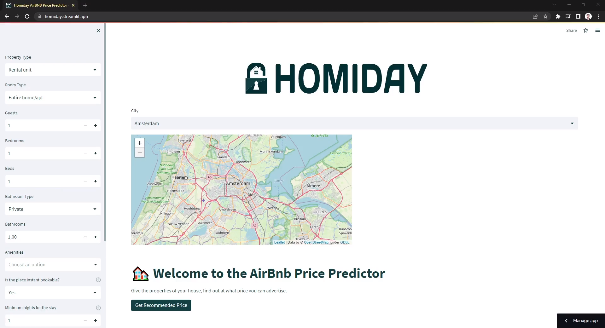

# HOMIDAY: AirBNB Price Prediction System

## Table of Contents

- [Introduction](#introduction)
- [Features](#features)
- [Usage](#usage)
- [License](#license)

## Introduction

The machine learning project HOMIDAY is focused on home price prediction. Within the scope of the project, data obtained from Airbnb listings in 18 different cities in Europe were used. A total of 250.000 data were used for the project. This data includes the details of each posting. For example, factors such as the city where it is located, the size of the house, the number of rooms, the number of bathrooms, and location features are among the details of the advertisement.

## Features

- Price recommendation for new users
- Easy to use dashboard

## Usage

Click on image to watch usage demo of the application.
)

## License

The data is taken from http://insideairbnb.com/get-the-data for each city and compiled into a single dataset

---
